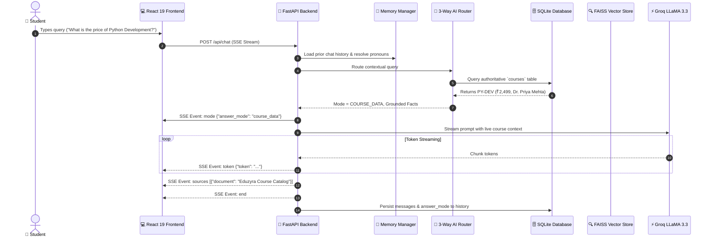

# 🎓 Eduzyra AI — 3-Way Hybrid Educational Assistant

[](https://fastapi.tiangolo.com)
[](https://react.dev)
[](https://groq.com)
[](https://github.com/facebookresearch/faiss)
[](https://docs.pytest.org)
[](https://www.docker.com)
[](LICENSE)

An enterprise-grade, ultra-responsive **3-Way Hybrid AI Educational Assistant** engineered for the **Eduzyra** learning platform. Unlike traditional chatbots that either rely purely on general LLMs (hallucinating course details and prices) or rigid static databases, Eduzyra AI dynamically routes queries through a multi-layered classification engine to provide real-time, zero-hallucination answers.

---

## 🌟 Key Highlights & Capabilities

- 🎓 **Single Source of Truth Course Integration**: Directly queries the live SQLite database (`courses` table) via SQLAlchemy 2.0 async ORM. Live price drops, discount percentages, and syllabus changes reflect immediately with zero prompt duplication.
- 📚 **Production RAG Engine**: Semantic document search powered by local `all-MiniLM-L6-v2` embeddings and FAISS vector indexing with rich metadata tracking (`document_id`, `page`, `section`, `chunk_index`).
- 💡 **General Educational Intelligence**: Seamless fallback to Groq's high-speed LLaMA 3.3 70B for computer science theory, mathematical derivations, and coding exercises without fabricated citations.
- 🧠 **Multi-Turn Context & Pronoun Resolution**: Intelligently resolves conversational references (*"Who teaches it?"*, *"What is its price?"*, *"Give an example in C++"*) to active entities across conversation turns.
- ⚡ **Real-Time Token SSE Streaming**: Unbuffered Server-Sent Events with structured event dispatching (`start` $\rightarrow$ `mode` $\rightarrow$ `token` $\rightarrow$ `sources` $\rightarrow$ `end`).
- 🎨 **Modern Glassmorphism UI**: React 19 SPA with dark mode, interactive Markdown rendering, syntax-highlighted code blocks with 1-click copy, categorized query suggestions, and error retry support.
- 🧪 **Comprehensive Automated Test Suite**: 69 unit, integration, and end-to-end tests covering all routing scenarios, edge cases, and safety barriers.

---

## 🏛️ System Architecture

```
                                    ┌────────────────────────┐
                                    │    React 19 SPA UI     │
                                    │ (Markdown, Badges, SSE)│
                                    └───────────┬────────────┘
                                                │ HTTP / SSE Stream
                                                ▼
                                    ┌────────────────────────┐
                                    │   FastAPI Gateway API   │
                                    └───────────┬────────────┘
                                                │
                                                ▼
                                ┌────────────────────────────────┐
                                │     3-Way AI Router Engine     │
                                └───────┬───────────┬────────────┘
                                        │           │
                 ┌──────────────────────┘           └──────────────────────┐
                 ▼                                  ▼                      ▼
    ┌─────────────────────────┐        ┌─────────────────────────┐  ┌──────────────┐
    │   1. Course Data Mode   │        │     2. RAG Doc Mode     │  │ 3. Direct    │
    │  (Live DB Single Source)│        │   (FAISS + Embeddings)  │  │   LLM Mode   │
    └────────────┬────────────┘        └────────────┬────────────┘  └──────┬───────┘
                 │                                  │                      │
                 ▼                                  ▼                      │
    ┌─────────────────────────┐        ┌─────────────────────────┐         │
    │ SQLite courses Table    │        │ FAISS Vector Index      │         │
    │ (Live Prices & Syllabi) │        │ (PDFs, DOCX, Handbook)  │         │
    └────────────┬────────────┘        └────────────┬────────────┘         │
                 │                                  │                      │
                 └──────────────────┬───────────────┴──────────────────────┘
                                    │ Grounded Context + Conversation History
                                    ▼
                        ┌────────────────────────┐
                        │   Groq LLaMA 3.3 70B   │
                        │    Inference Engine    │
                        └───────────┬────────────┘
                                    │ Token Stream + Structured Sources
                                    ▼
                        ┌────────────────────────┐
                        │ Server-Sent Events SSE │
                        └────────────────────────┘
```

### Mermaid Sequence Diagram


---

## 🔀 The 3-Way Hybrid Routing Pipeline

The core intelligence of Eduzyra AI lies in its deterministic 3-tier routing engine:

| Answer Mode | Trigger Condition | Source of Truth | Attribution Citation |
| :--- | :--- | :--- | :--- |
| **🎓 `course_data`** | Course pricing, syllabus, instructor, comparison, or discovery queries | SQLite `courses` table via `CourseService` | `🎓 Eduzyra Course Catalog` |
| **📚 `rag`** | Institutional policies, refund rules, scholarships, uploaded documentation | FAISS vector store with similarity score $\ge 0.35$ | `📚 [Document], Page [N] \| Section: [Heading]` |
| **💡 `direct`** | General programming, algorithmic concepts, math, science, or conceptual logic | Groq LLaMA 3.3 70B general world knowledge | `💡 General Educational Knowledge` |

---

## 🔒 Single Source of Truth for Course Data

### Why It Matters:
Hardcoding course details into prompts, Python dictionaries, or vector embeddings causes **severe real-world synchronization bugs**:
- When prices change from ₹2,499 to ₹1,999 during a sale, static prompt bots quote the old price.
- Course syllabus updates fail to reflect without re-embedding entire document sets.

### The Eduzyra Solution:
1. **Authoritative Relational Schema**: Every course is stored in the database with live pricing (`current_price`, `original_price`, `discount_percent`), syllabus JSON array, prerequisites, ratings, and instructor profiles.
2. **Zero Prompt Duplication**: Prompts contain no hardcoded prices. Context is injected dynamically on every request.
3. **Anti-Hallucination Barrier**: If a user asks for a non-existent course (*"Quantum Cooking Masterclass"*), the database returns 0 matches, and the model is strictly constrained to state unavailability rather than making up numbers.

---

## 🛠️ Technology Stack & Architectural Justifications

| Component | Technology | Justification |
| :--- | :--- | :--- |
| **Backend API** | FastAPI + Python 3.12 | Native async support, high concurrency, automatic OpenAPI documentation, and SSE streaming compatibility. |
| **Database** | SQLite + SQLAlchemy 2.0 Async (`aiosqlite`) | Fully async, zero-setup embedded relational storage with native JSON column parsing. |
| **LLM Provider** | Groq API (`llama-3.3-70b-versatile`) | Ultra-low latency inference (300+ tokens/sec) providing immediate conversational response times. |
| **Embeddings** | `sentence-transformers` (`all-MiniLM-L6-v2`) | High-performance 384-dimensional dense vectors running locally on CPU without external API costs or rate limits. |
| **Vector Index** | FAISS CPU (`langchain-community`) | Sub-millisecond similarity search with L2 distance normalization. |
| **Frontend UI** | React 19 + Vite | Lightweight, fast build times, responsive component hierarchy, and smooth state transitions. |
| **Markdown Rendering** | `react-markdown` + `remark-gfm` | Robust GitHub-flavored markdown parsing with custom syntax styling and copyable code blocks. |
| **Web Server** | Nginx Alpine | Low-footprint static asset delivery with dedicated unbuffered reverse proxy for SSE streams. |

---

## 📡 Complete API Reference

### Chat & Streaming
| Method | Endpoint | Description |
| :--- | :--- | :--- |
| `POST` | `/api/chat` | Main chat endpoint returning real-time Server-Sent Events (`text/event-stream`). |

**Request Body:**
```json
{
  "message": "What is the price of Python Development Masterclass?",
  "conversation_id": "4981eb7b-e1f6-4bb6-b487-515c07ca059f"
}
```

**SSE Events Emitted:**
```text
data: {"event": "start", "conversation_id": "4981eb7b-..."}
data: {"event": "mode", "answer_mode": "course_data"}
data: {"event": "token", "token": "Python "}
data: {"event": "token", "token": "Development costs ₹2,499."}
data: {"event": "sources", "sources": [{"document": "Eduzyra Course Catalog", "source_type": "course_catalog"}], "answer_mode": "course_data"}
data: {"event": "end"}
```

---

### Course Catalog Endpoints
| Method | Endpoint | Description |
| :--- | :--- | :--- |
| `GET` | `/api/courses` | List all available courses with optional filtering by category and level. |
| `GET` | `/api/courses/{code}` | Retrieve full details, syllabus, and instructor profile for a course code (e.g. `PY-DEV`). |
| `POST` | `/api/courses/search` | Search courses by keyword query with relevance scoring. |
| `POST` | `/api/courses/compare` | Structured side-by-side comparison of 2 or more courses. |

---

### Conversation History Endpoints
| Method | Endpoint | Description |
| :--- | :--- | :--- |
| `GET` | `/api/conversations` | List past conversation threads with timestamps. |
| `GET` | `/api/conversations/{id}` | Get full message history, citations, and answer modes for a thread. |
| `DELETE` | `/api/conversations/{id}` | Delete a conversation and associated message logs. |

---

### Knowledge Base & Admin Endpoints
| Method | Endpoint | Header Requirement | Description |
| :--- | :--- | :--- | :--- |
| `GET` | `/api/documents` | None | List uploaded knowledge base documents and chunk counts. |
| `POST` | `/api/admin/documents/upload` | `X-Admin-Key: <key>` | Upload PDF, DOCX, or TXT file to process, chunk, and index into FAISS. |
| `DELETE` | `/api/admin/documents/{id}` | `X-Admin-Key: <key>` | Delete a document and purge its vectors from FAISS. |
| `POST` | `/api/admin/documents/reindex` | `X-Admin-Key: <key>` | Rebuild the FAISS vector index from all active documents. |

---

### Health & System
| Method | Endpoint | Description |
| :--- | :--- | :--- |
| `GET` | `/api/health` | System health check (app version, DB connectivity, vector index count). |

---

## 🚀 Quickstart Guide

### Prerequisites
- Python 3.11+
- Node.js 18+ & npm
- A free [Groq API Key](https://console.groq.com)

---

### Option A: Local Development Setup

#### 1. Clone & Configure Environment
```bash
git clone https://github.com/Harshitkumar63/AI-Chatbot.git
cd AI-Chatbot
cp .env.example .env
```
*Open `.env` and insert your `GROQ_API_KEY`.*

#### 2. Backend Setup
```bash
cd backend
python -m venv venv

# Windows:
.\venv\Scripts\activate
# Linux/macOS:
source venv/bin/activate

pip install -r requirements.txt
uvicorn app.main:app --reload --port 8000
```
*The backend automatically creates the database and seeds the authoritative course catalog on startup.*

#### 3. Frontend Setup
```bash
# In a new terminal:
cd frontend
npm install
npm run dev
```
Open **`http://localhost:5173`** in your browser.

---

### Option B: Docker Compose (Production Ready)

Run the full multi-container stack with a single command:

```bash
docker compose up --build -d
```

- **Frontend Application**: `http://localhost:3000`
- **Backend API & Swagger Docs**: `http://localhost:8000/docs`
- **Health Check**: `http://localhost:8000/api/health`

To view live container logs:
```bash
docker compose logs -f
```

To stop containers:
```bash
docker compose down
```

---

## ⚙️ Environment Variables Reference

| Variable | Default Value | Description |
| :--- | :--- | :--- |
| `GROQ_API_KEY` | *Required* | API key from Groq Console for high-speed LLM inference. |
| `LLM_MODEL_NAME` | `llama-3.3-70b-versatile` | Groq model identifier for generating completions. |
| `LLM_MAX_TOKENS` | `1024` | Maximum tokens per completion. |
| `LLM_TEMPERATURE` | `0.7` | Sampling temperature (0.0 = deterministic, 1.0 = creative). |
| `EMBEDDING_MODEL_NAME`| `all-MiniLM-L6-v2` | SentenceTransformer model used for dense semantic embeddings. |
| `DATABASE_URL` | `sqlite+aiosqlite:///data/chatbot.db` | SQLAlchemy 2.0 async database connection URI. |
| `RAG_SIMILARITY_THRESHOLD` | `0.35` | Minimum cosine similarity score required to trigger RAG mode. |
| `ADMIN_API_KEY` | `eduzyra-admin-secret-key-change-me` | Secret key for `/api/admin/*` administrative routes. |
| `UPLOAD_DIR` | `data/uploads` | Local directory for storing uploaded knowledge base files. |
| `VECTOR_STORE_PATH` | `data/vector_store` | Local directory for FAISS vector index binary files. |

---

## 🧪 Automated Testing Suite

The project includes an exhaustive test suite built with `pytest` and `anyio`.

```bash
cd backend
.\venv\Scripts\pytest.exe -v
```

### Test Suite Summary (69 Passed in 5.2s):
- `tests/test_admin.py` (9 tests): Document uploads, deletions, security auth validation, re-indexing.
- `tests/test_chat.py` (6 tests): Chat endpoints, SSE streaming protocols, event parsing.
- `tests/test_courses.py` (10 tests): Course database querying, filtering, comparisons, context generation.
- `tests/test_documents.py` (8 tests): PDF/DOCX/TXT text extraction, chunking, and metadata preservation.
- `tests/test_e2e_scenarios.py` (7 tests): All 7 required end-to-end integration scenarios.
- `tests/test_memory.py` (7 tests): Multi-turn conversation sliding window & pronoun resolution.
- `tests/test_rag.py` (12 tests): Prompt assembly, citation attribution, and FAISS scoring.
- `tests/test_router.py` (10 tests): 3-way hybrid query routing across course data, RAG, and direct LLM.

---

## 📁 Project Directory Structure

```text
AI-Chatbot/
├── docker-compose.yml              # Multi-container orchestration (Frontend + Backend)
├── .env.example                    # Environment variable template
├── .gitignore                      # Git exclusion rules
├── README.md                       # Comprehensive documentation
│
├── backend/
│   ├── Dockerfile                  # Python 3.12 slim multi-stage production Dockerfile
│   ├── requirements.txt            # Python dependencies
│   ├── app/
│   │   ├── main.py                 # FastAPI application factory & lifecycle hooks
│   │   ├── config.py               # Pydantic v2 settings management
│   │   ├── api/                    # REST routers
│   │   │   ├── admin.py            # Document management & re-indexing
│   │   │   ├── chat.py             # SSE streaming chat endpoint
│   │   │   ├── conversations.py    # Conversation history management
│   │   │   ├── courses.py          # Authoritative course catalog endpoints
│   │   │   ├── documents.py        # Public document listing
│   │   │   ├── health.py           # Health check endpoint
│   │   │   └── router.py           # Master API router aggregator
│   │   ├── core/                   # Core business logic
│   │   │   ├── chat_service.py     # End-to-end SSE chat execution pipeline
│   │   │   ├── document_processor.py# Text chunking with rich section/page metadata
│   │   │   ├── memory_manager.py   # Multi-turn history & pronoun resolution
│   │   │   ├── rag_engine.py       # 3-Way grounded prompt builder
│   │   │   └── router.py           # Multi-layer intent classifier & router
│   │   ├── db/                     # Database layer
│   │   │   ├── init_db.py          # Auto table creation & column migrations
│   │   │   ├── session.py          # SQLAlchemy async session factory
│   │   │   └── seed_courses.py     # Authoritative 8-course catalog seed dataset
│   │   ├── models/                 # Schemas & ORM models
│   │   │   ├── database.py         # Course, Conversation, Message, Document models
│   │   │   ├── enums.py            # AnswerMode, MessageRole, DocumentStatus
│   │   │   └── schemas.py          # Pydantic request/response schemas
│   │   ├── services/               # Infrastructure services
│   │   │   ├── course_service.py   # Course queries, comparisons, context formatter
│   │   │   ├── embedding_service.py# Local SentenceTransformer embeddings
│   │   │   ├── llm_provider.py     # Modular LLM abstraction (GroqLLMProvider)
│   │   │   ├── llm_service.py      # LLM stream generation wrapper
│   │   │   └── vector_store.py     # FAISS vector store manager
│   │   └── utils/                  # Utilities, logging & prompts
│   │       ├── exceptions.py       # Custom domain exceptions
│   │       ├── logger.py           # Structured logging
│   │       └── prompts.py          # Grounded anti-hallucination prompt templates
│   └── tests/                      # Pytest automated test suite (69 tests)
│
└── frontend/
    ├── Dockerfile                  # Node 20 builder -> Nginx Alpine runtime
    ├── nginx.conf                  # Nginx SPA fallback + SSE reverse proxy config
    ├── package.json                # Dependencies (React 19, react-markdown, remark-gfm)
    ├── vite.config.js              # Vite configuration
    ├── index.html                  # HTML5 entry with SEO tags
    └── src/
        ├── App.jsx                 # Root UI component
        ├── main.jsx                # React DOM entry point
        ├── components/             # React UI components
        │   ├── ChatHeader.jsx      # Branding, status pulse, capability pills
        │   ├── ChatInput.jsx       # Auto-expanding textarea & submit
        │   ├── ChatWindow.jsx      # Categorized suggestion grid, error retry
        │   ├── MessageBubble.jsx   # ReactMarkdown, code copy, mode badges
        │   ├── SourceCitation.jsx  # Collapsible source cards & confidence scores
        │   └── TypingIndicator.jsx # Animated typing dots
        ├── hooks/
        │   └── useChat.js          # Chat state management & SSE event handler
        ├── services/
        │   └── api.js              # Fetch / ReadableStream SSE service
        └── styles/
            └── index.css           # Glassmorphism dark-theme design system
```

---

## 💡 Why This Architecture?

1. **Why not put course data into FAISS?**
   Vector similarity is probabilistic. Searching for *"What is the price of course X?"* in a vector store can retrieve a chunk with an outdated price or a related course's price if the embedding distance is close. By using a relational database (`courses` table) as the **single source of truth**, prices and course facts are 100% deterministic and real-time.
2. **Why local embeddings (`all-MiniLM-L6-v2`) instead of OpenAI Embeddings?**
   Zero API cost, zero network latency, complete data privacy, and predictable performance on any CPU without external dependency failure points.
3. **Why Groq LLaMA 3.3 70B?**
   Delivers instantaneous time-to-first-token (<200ms) with state-of-the-art reasoning quality for coding, math, and structured explanations.
4. **Why Server-Sent Events (SSE) over WebSockets?**
   Chat responses are unidirectional (client sends message $\rightarrow$ server streams tokens). SSE is simpler, runs over standard HTTP/1.1 or HTTP/2, automatically handles reconnects, and works seamlessly with Nginx reverse proxies.

---

## 📄 License

Distributed under the MIT License. See [`LICENSE`](LICENSE) for details.
